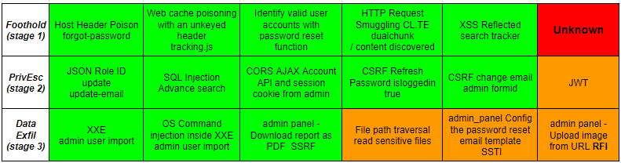

# MUST KNOWS
```ad-success
title: MUST
- **Default Credentials**:
	- Low-privilige: carlos
	- Admin: administrator
- One of them will visit the **homepage** every **15 seconds**
- They will click every link that they receive via **email**
- For **SSRF**:
	- localhost:6566
- Enumeration:
	- [[Usernames]]
	- [[Passwords]]
```



# Initial
1. Use thorough scan
2. Check ***/.git***
3. Check ***/robots.txt***
4. Check ***/api***
5. Visit every endpoint
6. Active scan every endpoint
7. Content Discovery
8. Check for inline Javascript
9. Check the loaded Javascript files

# Stage1
- [ ] [[XSS]]
- [x] [[CSRF]]
- [x] [[Clickjacking]]
- [x] [[DOM-based]]
- [x] [[CORS]]
- [x] [[Http request smuggling]]
- [x] [[Access-control]]
- [x] [[Authentication]]
- [x] [[Web cache poisoning]]
- [x] [[Http host header]]
- [x] [[Oauth authentication]]
- [x] [[Jwt]]

# Stage2
- [ ] [[XSS]]
- [ ] [[CSRF]]
- [ ] [[Clickjacking]]
- [ ] [[DOM-based]]
- [ ] [[CORS]]
- [ ] [[Http request smuggling]]
- [ ] [[Access-control]]
- [ ] [[Authentication]]
- [ ] [[Web cache poisoning]]
- [ ] [[Http host header]]
- [ ] [[Oauth authentication]]
- [ ] [[Jwt]]

# Stage3
- [x] [[SQLInjection]]
- [ ] [[XXE]]
- [ ] [[SSRF]]
- [ ] [[Os command  injection]]
- [ ] [[Server side template injection]]
- [ ] [[Directory traversal]]
- [ ] [[InsecureDeserialization]]
- [ ] [[File upload vulnerabilities]]

